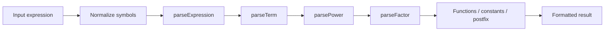
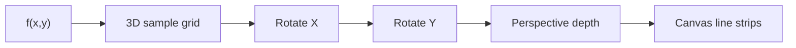
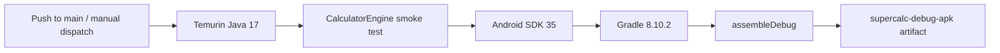

<div align="center">

# ⚡ SUPERCALC

### Android scientific calculator · 3D math visualizer · utility toolbox · hidden Snake

一個用原生 Android / Java 打造的深色科技風多功能計算機。核心運算不是呼叫 WebView 或第三方 evaluator，而是由 repository 內的 expression parser 直接解析與計算。

[](https://github.com/jerry0327/SUPERCALC/actions/workflows/build-apk.yml)


**[功能](#功能總覽)** · **[運算核心](#運算核心)** · **[3d-plot](#3d-plot)** · **[apk-build](#apk-build)**

</div>

---

## 為什麼不只是「四則運算」

SUPERCALC 把四個小型 Android 體驗放在同一個 app：

1. **Scientific calculator** — 自製 parser、函數、DEG / RAD、歷史紀錄。
2. **3D Plot** — 自訂 `View` 即時計算並投影數學曲面，可旋轉與縮放。
3. **Utility toolbox** — 單位、BMI、貸款、折扣與稅率試算。
4. **Snake easter egg** — 自訂 game loop、碰撞、食物生成與 score。

UI 主要由 `MainActivity` 以原生 Android widgets 動態組成；3D Plot 與 Snake 則各自使用 custom `View` 繪製，沒有把功能包在網頁殼裡。

## 功能總覽

| 模組 | 已實作能力 |
| --- | --- |
| **Calculator** | `+ − × ÷`、括號、Ans、百分比、`mod`、factorial |
| **Scientific** | `sin`、`cos`、`tan`、`asin`、`acos`、`atan`、`log`、`ln`、`sqrt`、`abs`、`floor`、`ceil`、`round` |
| **Constants / powers** | π、e、平方、任意次方 |
| **Angle mode** | DEG / RAD 即時切換 |
| **History** | 計算結果保存與歷史頁面 |
| **3D Plot** | 四種曲面、X/Y rotation、zoom、透視投影 |
| **Unit conversion** | 公尺→公分、公斤→磅、°C→°F |
| **BMI** | BMI 與簡單區間分類 |
| **Loan** | 本金 / 年利率 / 年數 → 月付試算 |
| **Discount / tax** | 折扣與稅率試算 |
| **Snake** | 24×16 grid、score、self / wall collision、direction guard |

## 運算核心

`CalculatorEngine` 是一個小型 recursive-descent expression parser：



解析順序保留一般數學 precedence：

```text
expression  -> + / -
term        -> * / / / mod
power       -> ^  (right-associative)
factor      -> unary, parentheses, numbers, functions, π/e
postfix     -> ! / %
```

例如：

```text
1 + 2 * 3                   → 7
5!                          → 120
10 mod 3                    → 1
50%                         → 0.5
sin(45) + log(100) + √256  → 18.70710678…
```

Repository 內的 smoke test會直接以 `javac` 執行上述核心案例，並另外驗證 RAD 模式下的 `sin(pi/2)`。

## 3D Plot

`Plot3DView` 不依賴外部 chart library。它在 Canvas 上建立網格、3D→2D perspective projection 與彩色 line strips，目前內建四種 surface：

- `z = sin(x) * cos(y)`
- `z = 3 sin(r) / r`
- `z = (x² - y²) / 18`
- `z = cos(x) + sin(y)`

使用者可以用三個 slider 改變 X rotation、Y rotation 與 zoom。



## Snake easter egg

`SnakeView` 使用 `Handler` 驅動 140 ms tick：

- 固定 grid game board
- 禁止直接 180° 反向
- 牆面 / self collision
- 隨機食物生成且避開蛇身
- 每次進食 +10 分
- pause / reset / game-over state

它不是圖片或假 UI，而是 repository 內真正可玩的 mini game。

## APK Build

這個 repo 已經有真正的 GitHub Actions build pipeline：



### 從 GitHub 下載 APK

1. 開啟 **Actions**。
2. 選擇 **Build Android APK**。
3. 手動執行 workflow，或使用 `main` push 觸發。
4. Build 成功後下載 `supercalc-debug-apk` artifact。
5. 解壓縮即可取得 debug APK。

Artifact retention 目前設定為 **7 days**。

## Local build

目前 Android 設定：

| Setting | Value |
| --- | --- |
| Application ID | `com.jerry0327.supercalc` |
| compileSdk | 35 |
| targetSdk | 35 |
| minSdk | 23 |
| versionName | 1.0 |

用可用的 Android SDK / Gradle 環境執行：

```bash
gradle assembleDebug
```

只驗證 calculator engine 時，不需要 Android runtime：

```bash
mkdir -p build/smoke-test
javac -encoding UTF-8 -d build/smoke-test \
  app/src/main/java/com/jerry0327/supercalc/CalculatorEngine.java \
  tools/CalculatorEngineSmokeTest.java
java -cp build/smoke-test CalculatorEngineSmokeTest
```

## Repository anatomy

```text
app/src/main/java/com/jerry0327/supercalc/
├── CalculatorEngine.java   expression parser / evaluator
├── MainActivity.java       navigation, calculator, toolbox, history UI
├── Plot3DView.java         custom 3D surface renderer
└── SnakeView.java          custom Snake game view

tools/
└── CalculatorEngineSmokeTest.java

.github/workflows/
└── build-apk.yml           smoke test + Android APK CI
```

> [!NOTE]
> 這個專案目前定位為小型 Android utility / experiment。計算、BMI、貸款與折扣結果適合一般工具用途，不應視為財務、醫療或專業決策依據。

---

<div align="center">

**SUPERCALC — calculate · visualize · explore**

</div>
